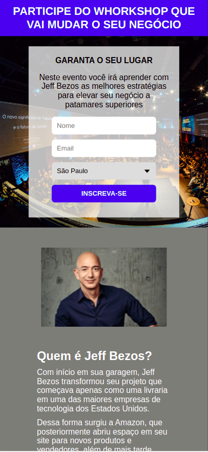
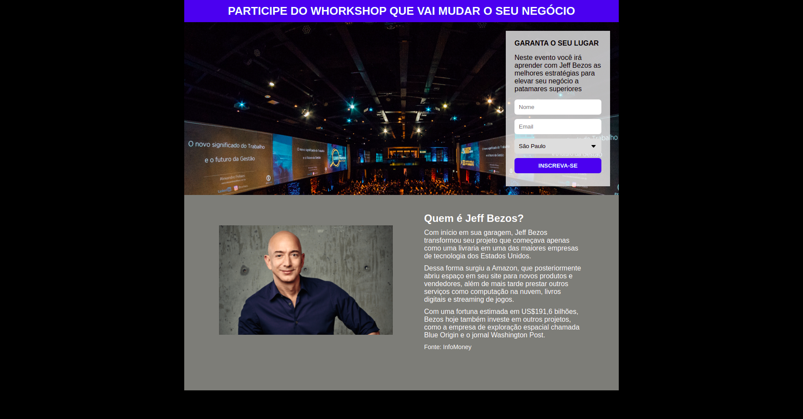

# 📋 Projeto Página de Captura

## 💎 Introdução

 Este projeto tem como objetivo a captura e envio de emails por meio de um formulário integrado à plataforma <a href="https://mailchimp.com/">Mailchimp</a>. Para isso, a página que você verá a seguir simula o cadastro em um whorkshop fictício com o fundador da Amazon, Jeff Bezos.

## 📱 Layout Mobile

## 💻 Layout Web

# ✅ Tecnologias
* HTML 5
* CSS 3
* Mailchimp

# 📝 Autor
https://www.linkedin.com/in/kauan-borotto-7904401a3/